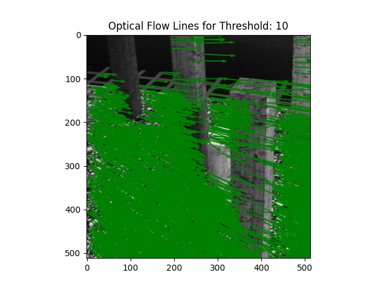

# Optical Flow
## Overview
This repository contains a project focused on optical flow analysis using the Lucas-Kanade method. Optical flow is a computer vision technique that tracks the motion of objects in a sequence of images. The Lucas-Kanade method is a differential method that estimates the flow vectors by solving a system of linear equations for each pixel.

  
  

  
  
  

## Key Components

### 1. Image Loading and Gradients

The project begins by loading a sequence of grayscale images. The gradients of these images (Ix, Iy, and It) are then computed using the Sobel operator.

### 2. Lucas-Kanade Optical Flow

The Lucas-Kanade method is applied to compute the optical flow for a specific frame in the image sequence. The flow vectors (u, v) and confidence values are obtained, providing insights into the motion of objects.

### 3. Visualization

The optical flow vectors are visualized on top of the original image using the `plot_flow` function. Different confidence thresholds can be applied to visualize only reliable flow information.

### 4. Epipole Computation

The code includes the computation of the epipole, which is the point in one image corresponding to the projection of the optical center of the other camera. The epipole is visualized on top of the optical flow field.

### 5. Depth Map
